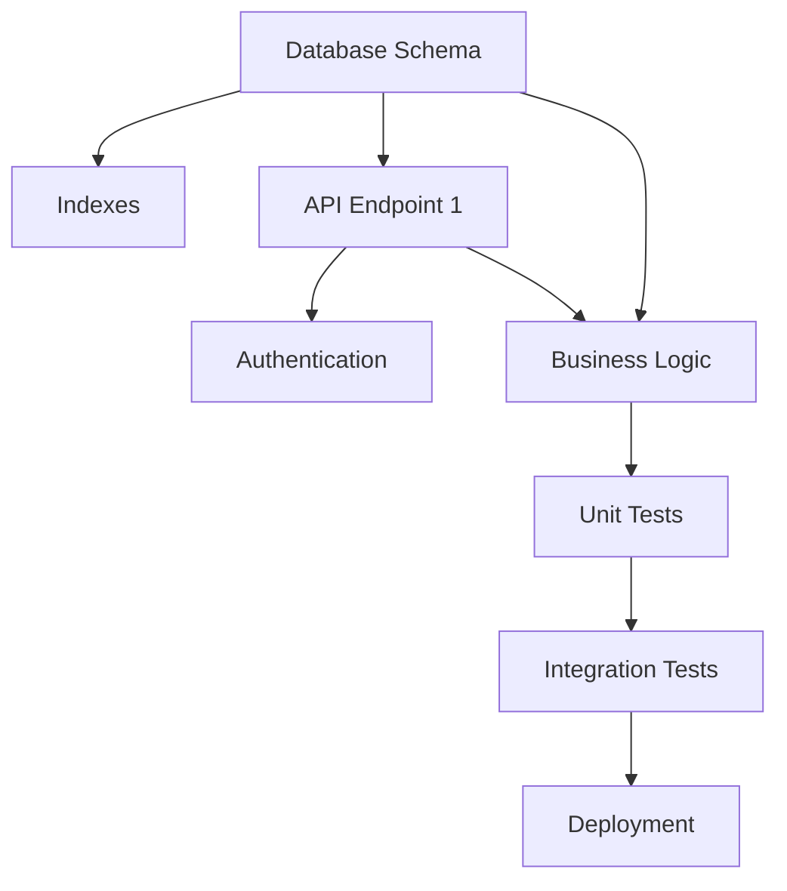

# Detailed Execution Plan Standards

## Abstract

**Purpose**: Define the structure and requirements for detailed execution plans that break down ERDs into granular, executable tasks with time estimates, dependencies, and risk assessment.

**When to Use**: After ERD is approved, before implementation begins. Execution plans translate ERD designs into specific, ordered tasks that can be executed by humans or AI agents.

**Key Requirements**:
- Phase breakdown with time/cost estimates per phase
- Task-level granularity (<4 hours per task)
- Explicit dependencies and parallel opportunities
- Risk assessment with mitigation strategies
- Rollback plans and success criteria
- Progress tracking via checklists

---

## Overview

**Execution Plan = Implementation Roadmap from ERD**

**Purpose**: Break down an approved ERD into granular, actionable tasks that can be executed sequentially or in parallel, with clear dependencies, time estimates, and success criteria.

**Format Origin**: Based on proven [marker-implementation-plan.md](.ai-sessions/2025-10-22/marker-implementation-plan.md) format used for test marker migration (1,428 tests marked in 2.5 hours).

**Key Benefits**:
- **Predictability**: Time estimates per task/phase
- **Parallelism**: Identify independent tasks that can run concurrently
- **Risk Management**: Flag high-risk tasks upfront with mitigation
- **Progress Tracking**: Checkboxes for deliverables and acceptance criteria
- **Rollback Safety**: Clear rollback procedures if things go wrong

---

## When to Create Execution Plans

**REQUIRED for**:
- Complex implementations (>3 hours estimated)
- Multi-phase projects
- Changes affecting multiple components
- High-risk changes (database, authentication, payment)
- Migrations (data, architecture, dependencies)

**OPTIONAL for**:
- Simple bug fixes (<1 hour)
- Documentation updates
- Single-file changes

**Exception**: User says "skip the plan" or emergency hotfix.

---

## Mandatory Structure

### 1. Header Section

```markdown
# Detailed Plan: [Feature/Change Name]

**Date**: YYYY-MM-DD
**Estimated Time**: X-Y hours
**Target**: [One sentence summary]
**ERD Reference**: [Link to ERD if exists]
**Issue**: #[issue_number] (if applicable)

---

## Table of Contents

1. [Overview](#overview)
2. [Phase 0: Preparation](#phase-0-preparation)
3. [Phase 1: Implementation](#phase-1-implementation)
4. [Phase N: Validation](#phase-n-validation)
5. [Rollback Plan](#rollback-plan)
6. [Success Criteria](#success-criteria)
```

### 2. Overview Section

**Required elements**:
- Problem statement (current vs desired state)
- Strategy/approach (high-level how)
- Time breakdown by phase

**Example**:
```markdown
## Overview

### Problem Statement

**Current state**:
- 1,436 total tests
- 8 marked tests (0.6%)
- 1,428 unmarked tests (99.4%)
- Can't run selective test suites
- Pre-commit runs all tests (slow → developers bypass)

**Desired state**:
- 100% of tests marked
- `pytest -m unit` runs ~1,200 fast tests (30 sec)
- `pytest -m integration` runs ~236 slow tests (CI only)
- Pre-commit runs only unit tests locally
- Enforcement prevents new unmarked tests

### Strategy

**Heuristic-based automated marking**:
1. File path contains `integration/` → `@pytest.mark.integration`
2. Test name contains `integration` → `@pytest.mark.integration`
3. Test imports `requests`, `httpx`, real APIs → `@pytest.mark.integration`
4. Everything else → `@pytest.mark.unit`

**Manual review**: 10% sample (143 tests) to validate accuracy
```

### 3. Phase Breakdown

**Each phase MUST include**:
- **Phase name and time estimate**
- **Step-by-step instructions** with bash commands
- **Validation commands** (how to verify success)
- **Expected output** (what success looks like)

**Step format**:
```markdown
## Phase 1: Analysis (30 min)

### Step 1.1: Analyze Test File Distribution

Create analysis script:

```bash
cat > analyze_tests.py << 'EOF'
#!/usr/bin/env python3
"""Analyze test files to inform marker strategy."""
# [Script content here]
EOF

chmod +x analyze_tests.py
```

**Validation**:
```bash
python analyze_tests.py
```

**Expected output**:
```
=== Test Marker Analysis ===

Total tests found: 1436
Already marked: 8
Need markers: 1428
```
```

**Key Requirements**:
- [ ] Bash commands are copy-paste ready (no placeholders like `[FILE]`)
- [ ] Each step has validation (how to verify it worked)
- [ ] Expected output shown (so reader knows what success looks like)
- [ ] Steps are sequential within phase
- [ ] "Point of no return" steps clearly marked

### 4. Task-Level Detail (For Complex Phases)

**For phases with multiple independent tasks**, break down further:

```markdown
### Phase 2: API Implementation (12 hours, $3.00)

#### Task 2.1: Implement POST /api/resource Endpoint
- **ID**: TASK-2.1
- **Description**: Implement POST endpoint with validation
- **Dependencies**: TASK-1.1 (needs database schema)
- **Estimated Time**: 4 hours
- **Estimated Cost**: $1.00 (Anthropic API for code generation)
- **Risk**: Medium (depends on external API)
- **Deliverables**:
  - [ ] API endpoint in `routes/resource.py`
  - [ ] Request/response validation using Pydantic
  - [ ] Error handling per ERD error strategy
  - [ ] Logging for key events
- **Acceptance Criteria**:
  - [ ] Endpoint accepts valid requests (per ERD spec)
  - [ ] Endpoint rejects invalid requests with HTTP 400
  - [ ] Endpoint handles external API failures with HTTP 502
  - [ ] Endpoint logs all requests and errors
  - [ ] Response time < 200ms (PRD requirement)
```

**Task Requirements**:
- **Time estimate**: <4 hours (one work session)
- **Dependencies**: Explicit list of tasks that must complete first
- **Deliverables**: Checkboxes for concrete outputs
- **Acceptance Criteria**: Checkboxes for how to verify success
- **Risk level**: Low/Medium/High with rationale

### 5. Dependency Graph

**For complex plans, MUST include Mermaid diagram**:

```markdown
## Dependency Graph



### Can Run in Parallel:
- TASK-1.2 (Indexes) and TASK-2.1 (API Endpoint) - after TASK-1.1 completes
- TASK-4.1 (Unit Tests) - can start while TASK-4.2 is being planned

### Must Run Sequentially:
- TASK-1.1 before everything (foundational)
- TASK-3.1 before TASK-4.1 (can't test code that doesn't exist)
- TASK-4.2 before TASK-5.1 (don't deploy failing code)
```

### 6. Rollback Plan

**MANDATORY for any changes that affect**:
- Database schema
- Production configuration
- External integrations
- User-facing features

**Required elements**:
```markdown
## Rollback Plan

If problems occur, revert with:

```bash
# Option 1: Revert the commit
git revert HEAD

# Option 2: Go back to checkpoint
git reset --hard <checkpoint-sha>

# Option 3: Specific rollback steps
[Commands to undo changes]
```

**When to rollback**:
- ❌ Tests fail due to implementation errors
- ❌ CI pipeline breaks
- ❌ Performance degrades >20%
- ❌ Production errors increase

**Rollback validation**:
```bash
# Commands to verify rollback worked
[Validation commands]
```
```

### 7. Success Criteria

**MANDATORY section** with go/no-go checklist:

```markdown
## Success Criteria

### Must Have (Go/No-Go)

- [ ] 100% of tests have markers (0 unmarked)
- [ ] Pre-commit hook blocks new unmarked tests
- [ ] `pytest -m unit` runs successfully
- [ ] `pytest -m integration` runs successfully
- [ ] All tests still pass (no regressions)

### Should Have (Quality)

- [ ] < 5% marker misclassification rate (validated by manual review)
- [ ] Pre-commit execution time < 45 seconds (down from 2+ minutes)
- [ ] Documentation updated (testing.md, README.md)

### Nice to Have (Stretch Goals)

- [ ] CI workflow updated to run unit tests in parallel
- [ ] Integration tests split into separate workflow
- [ ] Marker coverage report in CI
```

**Requirements**:
- Clear separation: Must Have (blockers) vs Should Have (quality) vs Nice to Have (stretch)
- Measurable criteria (numbers, percentages, pass/fail)
- Tied to original problem statement

### 8. Risk Assessment

**For plans with risks, MUST include**:

```markdown
## Risk Mitigation

**Risk**: AST transformation introduces syntax errors
**Likelihood**: Medium
**Impact**: High (breaks all tests)
**Mitigation**:
- Dry run first
- Use `pytest --collect-only` to validate
- Test on sample before full run
- Create checkpoint commit before changes

**Risk**: Pre-commit hook too strict
**Likelihood**: Low
**Impact**: Medium (blocks legitimate work)
**Mitigation**:
- Test hook before deploying
- Document override process for edge cases
- Can disable hook temporarily if needed
```

### 9. Time Breakdown Table

**OPTIONAL but recommended for multi-phase plans**:

```markdown
## Time Breakdown

| Phase | Task | Estimated | Actual |
|-------|------|-----------|--------|
| 0 | Preparation | 15 min | ___ |
| 1 | Analysis | 30 min | ___ |
| 2 | Automated Addition | 45 min | ___ |
| 3 | Manual Review | 30 min | ___ |
| 4 | Enforcement | 30 min | ___ |
| 5 | Documentation | 15 min | ___ |
| **Total** | | **2h 45min** | **___** |
```

**Purpose**: Track actual vs estimated time for future planning improvements.

---

## Quality Standards

### Granularity Requirements

**Phase level**:
- 15 min - 2 hours per phase
- Clear begin/end points
- Can be completed in one session

**Task level** (if used):
- <4 hours per task
- One clear deliverable
- Can pause after task completion

### Validation Requirements

**Every step MUST have**:
1. **Validation command**: How to check if step succeeded
2. **Expected output**: What success looks like
3. **Error handling**: What to do if step fails

**Example**:
```markdown
### Step 1.2: Baseline Test Run

```bash
pytest --collect-only > /tmp/tests-before.txt 2>&1
```

**Validation**:
```bash
echo "Total tests: $(grep -E '<Function|<Method' /tmp/tests-before.txt | wc -l)"
```

**Expected output**:
```
Total tests: 1436
```

**If output differs**: Check that pytest is discovering all test directories
```

### Command Requirements

**All bash commands MUST be**:
- Copy-paste ready (no manual edits needed)
- Safe (no `rm -rf` without confirmation)
- Idempotent where possible (can run multiple times safely)
- Quoted properly (file paths with spaces)

**Example (GOOD)**:
```bash
cd /Users/neerajgarg/fashion-extract
git checkout -b feature/add-test-markers
```

**Example (BAD)**:
```bash
cd [PROJECT_DIR]  # ❌ Placeholder
git checkout -b [BRANCH_NAME]  # ❌ Placeholder
```

---

## Integration with ERD Process

**Workflow**:
1. **BRD** → Why build this? (business problem)
2. **PRD** → What to build? (requirements)
3. **ERD** → How to build? (technical design)
4. **Execution Plan** → Detailed implementation steps (this document)
5. **Implementation** → Execute tasks from plan

**When to create Execution Plan**:
- AFTER ERD is approved
- BEFORE implementation begins
- When ERD is complex (>3 components or >8 hours estimated)

**Execution Plan vs ERD**:

| ERD | Execution Plan |
|-----|----------------|
| Architecture decisions | Step-by-step commands |
| Component design | Bash scripts and validation |
| High-level approach | Granular tasks (<4 hours) |
| "We'll use X pattern" | "Run this command to implement X" |
| Risk identification | Risk mitigation steps |
| Success criteria (what) | Success criteria (how to verify) |

---

## Anti-Patterns to Avoid

❌ **Vague time estimates**: "This should be quick"
- ✅ Fix: Specific time ranges (30-45 min, 2-3 hours)

❌ **No validation steps**: "Run script and hope it works"
- ✅ Fix: Every step has validation command + expected output

❌ **Placeholder commands**: `cd [PROJECT_DIR]`
- ✅ Fix: Actual commands with real paths

❌ **No rollback plan**: "We'll figure it out if things break"
- ✅ Fix: Explicit rollback commands tested before execution

❌ **Missing dependencies**: Tasks ordered incorrectly
- ✅ Fix: Dependency graph (Mermaid) + explicit prerequisites

❌ **No checkpoints**: All-or-nothing approach
- ✅ Fix: Git commits between phases, can resume mid-plan

❌ **Unclear success**: "It should work"
- ✅ Fix: Measurable success criteria with pass/fail tests

❌ **Too granular**: 50 tasks of 15 minutes each
- ✅ Fix: Group into phases, 3-8 phases per plan

❌ **Too coarse**: "Implement feature (8 hours)"
- ✅ Fix: Break into <4 hour tasks with clear deliverables

---

## Template

**Copy this template for new execution plans**:

```markdown
# Detailed Plan: [Feature Name]

**Date**: YYYY-MM-DD
**Estimated Time**: X-Y hours
**Target**: [One sentence summary]
**ERD Reference**: [Link if exists]

---

## Table of Contents

1. [Overview](#overview)
2. [Phase 0: Preparation](#phase-0-preparation)
3. [Phase N: [Name]](#phase-n-name)
4. [Rollback Plan](#rollback-plan)
5. [Success Criteria](#success-criteria)

---

## Overview

### Problem Statement

**Current state**:
- [What's the current situation]
- [What's the pain point]

**Desired state**:
- [What we want after this change]
- [How we'll know we succeeded]

### Strategy

[High-level approach]

---

## Phase 0: Preparation (X min)

### Step 0.1: [Name]

[Instructions]

```bash
[Commands]
```

**Validation**:
```bash
[Validation commands]
```

**Expected output**:
```
[What success looks like]
```

---

## Rollback Plan

[Rollback instructions]

---

## Success Criteria

### Must Have (Go/No-Go)

- [ ] [Criterion 1]
- [ ] [Criterion 2]

### Should Have (Quality)

- [ ] [Quality criterion 1]

---

## Risk Mitigation

**Risk**: [Description]
**Likelihood**: Low/Medium/High
**Impact**: Low/Medium/High
**Mitigation**: [Steps]
```

---

## Example: Real Execution Plan

**Reference**: [marker-implementation-plan.md](.ai-sessions/2025-10-22/marker-implementation-plan.md)

**What it demonstrates**:
- ✅ Granular phases (0-5) with time estimates
- ✅ Step-by-step bash commands (copy-paste ready)
- ✅ Validation commands + expected output
- ✅ Rollback plan with 3 options
- ✅ Success criteria (must/should/nice to have)
- ✅ Risk assessment with mitigation
- ✅ Time breakdown table
- ✅ Appendix with examples

**Outcome**: 1,428 tests marked in 2.5 hours (96% accuracy on first pass)

---

## References

- **BRD/PRD/ERD Standards**: [.claude/brd-prd-erd-standards.md](.claude/brd-prd-erd-standards.md)
- **Workflow Process**: [.claude/workflow.md](.claude/workflow.md)
- **Example Plan**: [marker-implementation-plan.md](.ai-sessions/2025-10-22/marker-implementation-plan.md)
- **Execution Plan Bot**: [execution-plan-generator-bot.md](../src/syra/bots/prompts/execution-plan-generator-bot.md)
